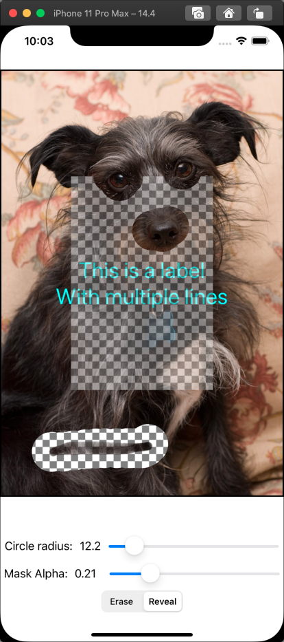

## MaskableImageView

This project demonstrates how to use a `CALayer` to mask a `UIView`.

It defines a custom subclass of UIImageView, `MaskableView`.

The `MaskableView` class has a property `maskLayer` that contains a CALayer. 

`MaskableView` implements an updateBounds() method property so that when the view's bounds change, it's view controller can notify it so it can update it's mask layer and rebuild it's sample mask image.

The `MaskableView ` has a method `installSampleMask` which builds an image the same size as the image view, mostly filled with opaque black, but with a small rectangle in the center filled with black at an alpha of 0.5. The translucent center rectangle causes the image view to become partly transparent and show the view underneath.

The demo app installs a couple of subviews into the `MaskableView`, a sample image of Scampers, one of my dogs, and a UILabel. It also installs an image of a checkerboard under the `MaskableView ` so that you can see the translucent parts more easily.

***

### The MaskableView class

The `MaskableView` has properties `circleRadius`, `maskDrawingAlpha`, and `drawingAction` that it uses to let the user erase/un-erase the image by tapping on the view to update the mask.

It attaches a custom subclass of `UIPanGestureRecognizer`, a `TouchDownPanGestureRecognizer`, to itself, with an action of `gestureRecognizerUpdate`. The `gestureRecognizerUpdate` method takes the tap/drag location from the gesture recognizer and uses it to draw a circle onto the image mask that either decreases the image mask's alpha (to partly erase pixels) or increase the image mask's alpha (to make those pixels more opaque.) The custom `TouchDownPanGestureRecognizer` is a very minor change to a normal `UIPanGestureRecognizer` that begins sending events on the first touch event rather than waiting for the user to drag.

It also has a property `circleCursorColor:UIColor`. It defaults to clear. If you set `circleCursorColor` to a non-clear color the `MaskableView` draws a "circle cursor" at the current tap point to show the shape the user is drawing into. The demo app's view controller sets the `circleCursorColor` to a slightly translucent yellow.

Its mask drawing is crude, and only meant for demonstration purposes. It draws a series of discrete circles intstead of rendering a path into the mask based on the user's drag gesture. A better solution would be to connect the points from the gesture recognizer and use them to render a smoothed curve into the mask.

***

The app's screen looks like this:

